# Kubernetes Microservices Deployment with HPA (Minikube on EC2)

---

## Project Overview

This project demonstrates deploying a **microservices-based application** using **Kubernetes (Minikube)** on an EC2 instance. 
- It includes:
  * Multiple microservices (User, Product, Order)
  * Docker containerization
  * Kubernetes Deployments & Services
  * Horizontal Pod Autoscaler (HPA)
  * Persistent Volume (PV) & Persistent Volume Claim (PVC)

---

## Architecture Diagram

```
                🌐 Internet (Browser)
                        ↓
              EC2 Public IP : NodePort
                        ↓
               Kubernetes Cluster (Minikube)
                        ↓
        -----------------------------------------
        |        |              |               |
   User Service  Product Service  Order Service
        |              |               |
     Pod(s)         Pod(s)          Pod(s)
        |
   Persistent Storage (PV + PVC)
```
  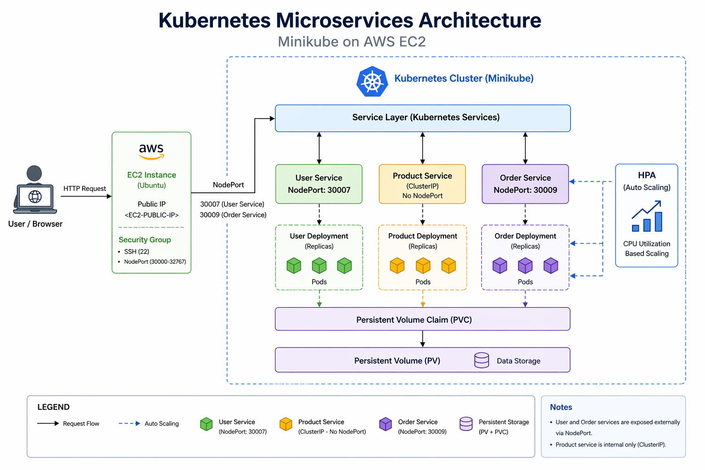
---

## Tools & Technologies Used

* AWS EC2 (Ubuntu)
* Docker
* Kubernetes (Minikube)
* kubectl
* Docker Hub
* YAML (K8s configurations)

---
## Project Structure

  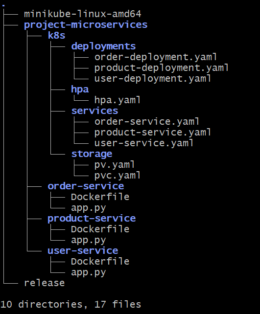
---

## Step-by-Step Setup

---

### 1. Launch EC2 Instance

* OS: Ubuntu
* Allow ports:

  * 22 (SSH)
  * 30000–32767 (NodePort range)
    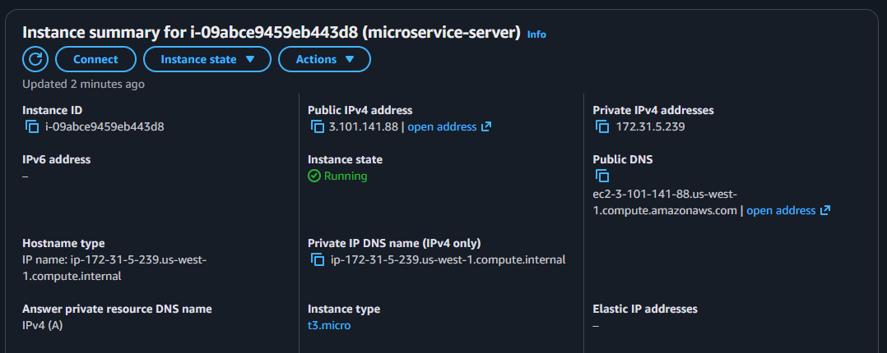
---

### 2. Install Docker

```bash
sudo apt update
sudo apt install docker.io -y
sudo systemctl start docker
sudo systemctl enable docker
```

---

### 3. Install Minikube

```bash
curl -LO https://storage.googleapis.com/minikube/releases/latest/minikube-linux-amd64
sudo install minikube-linux-amd64 /usr/local/bin/minikube
```

---

### 4. Install kubectl

```bash
curl -LO "https://dl.k8s.io/release/$(curl -L -s \
https://dl.k8s.io/release/stable.txt)/bin/linux/amd64/kubectl"

chmod +x kubectl
sudo mv kubectl /usr/local/bin/
```
  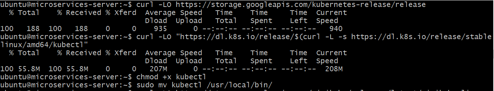
---

### 5. Start Minikube

```bash
minikube start --driver=docker
```
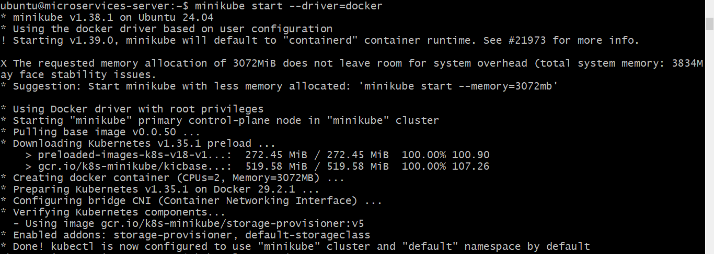
Enable metrics server:

```bash
minikube addons enable metrics-server
```

---

### 6. Login to Docker Hub
docker login

    Username: <your-github-username>
    Password: <your-github-password>

  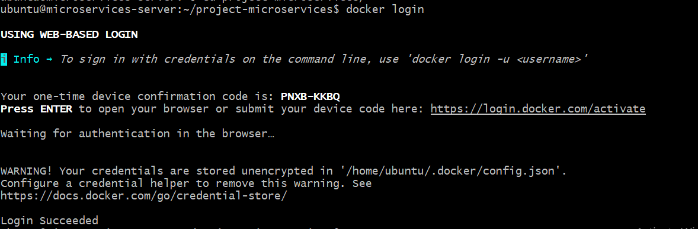

###  7.Docker Image Build & Push

- User Service
```bash
cd user-service
docker build -t <your-dockerhub-username>/user-service .
docker push <your-dockerhub-username>/user-service
```
  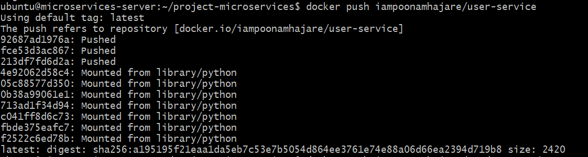
- Product Service
```bash
cd ../product-service
docker build -t <your-dockerhub-username>/product-service .
docker push <your-dockerhub-username>/product-service
```
- Order Service
```bash
cd ../order-service
docker build -t <your-dockerhub-username>/order-service .
docker push <your-dockerhub-username>/order-service
```
  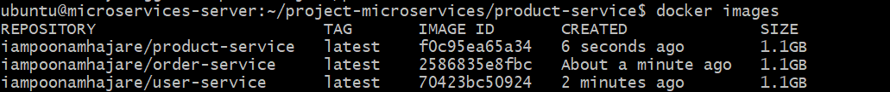
  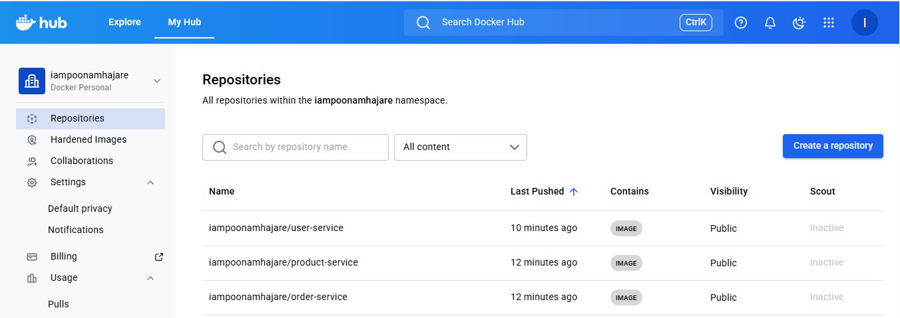
---

## 8. Kubernetes Deployment

Apply all configurations:

```bash
cd project-microservices/k8s/
kubectl apply -f deployments/
kubectl apply -f services/
kubectl apply -f hpa/
kubectl apply -f storage/
```
  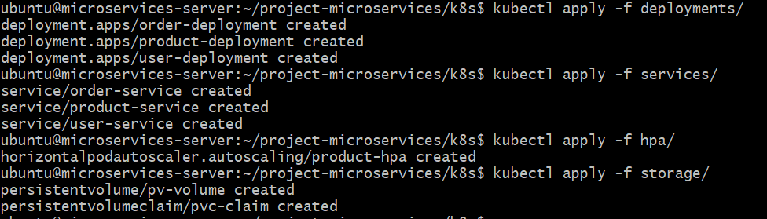
---

## 9. Verify Deployment

```bash
kubectl get pods
kubectl get svc
kubectl get hpa
kubectl get pv
kubectl get pvc
```
  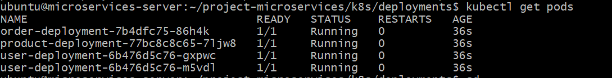
  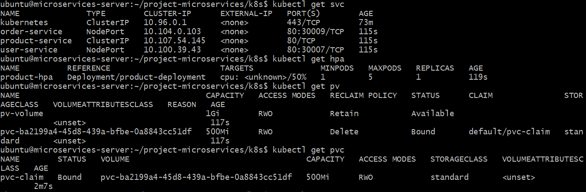
---

## 10. Access Services in Browser

```
cd project-microservices/k8s/
minikube service product-service
```
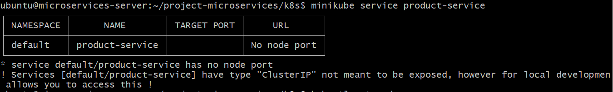

Access via:

```
http://<EC2-PUBLIC-IP>:30007  → User Service
http://<EC2-PUBLIC-IP>:30009  → Order Service
```
  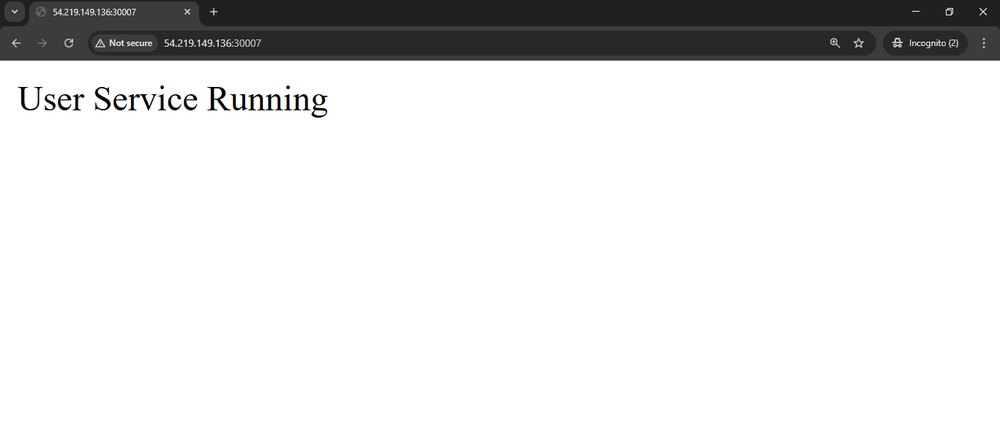
  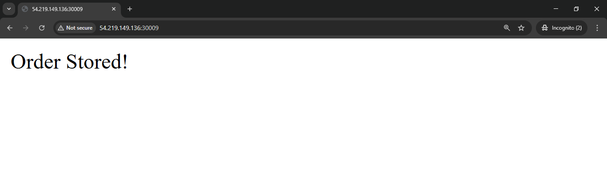
---

### Note
- Product Service is ClusterIP
- Cannot be accessed from browser
---

## Benefits of Using Kubernetes + Docker

* Scalability (HPA)
* High availability
* Easy deployment
* Microservices architecture
* Container portability

---

## Challenges Faced & Solutions

| Challenge              | Solution                                |
| ---------------------- | --------------------------------------- |
| Pod not starting       | Checked logs using `kubectl logs`       |
| ImagePull errors       | Pushed images to Docker Hub             |
| Service not accessible | Opened NodePort range in Security Group |
| HPA not working        | Enabled metrics-server                  |

---

## Conclusion

Successfully deployed a **scalable microservices application** using Kubernetes with auto-scaling and external access via NodePort.

---

